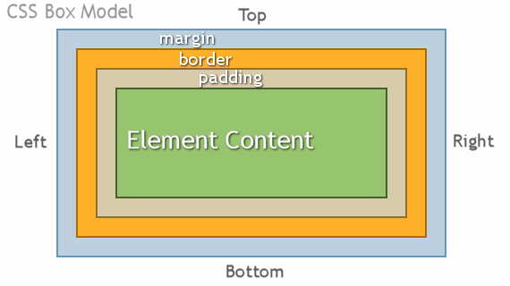

# Back To Some Visuals

Since my last entry, I've completed all Watch & Code exercises related to the Todo list MVC app.

I've also started to work through Jonas Schmedtmann's _Build Responsive Real World Websites_ Udemy course. Why? To take a break from working with just JS and refresh my HTML/CSS skills.

I'm definitely a bit rusty with CSS, but it feels good to work on visual stuff after focusing on just JS all month.

#### **Notes**:

**CSS Inheritance**: child elements inherit their styles from parent elements, unless we override their styles

<u>**CSS Box Model:**  </u>

 

  * __Content__: text, images, etc. 
  * __Padding__: transparent area around the content, inside of the border
  * __Border__: goes around the padding and the content
  * __Margin__: space outside the border and between other &#8220;boxes&#8221;

Changing the *height* and *width* of block elements sets just the content box dimensions. But this can be changed to include the padding and border by setting `box-sizing: border-box;`

**Block elements** use the full width of the browser and force line breaks.

**Inline elements** stay in the same line. You cannot set their height of width. (But you can set `display: inline-block` to override this.)

**Relative positioning:** when an element&#8217;s positioning on the webpage is determined by other elements.

**Absolute positioning:** elements with absolute positioning can be positioned anywhere within a parent element.

I also have a bunch of notes on best practices for web design, regarding: typography, colors, images, icons, spacing & layout, and UX. However, they were mostly copied almost word-for-word from Jonas&#8217;s course so not going to post it here.

My favorite section so far has been his steps/process to creating a fully functional website, starting with project goals and ending with site maintenance.
