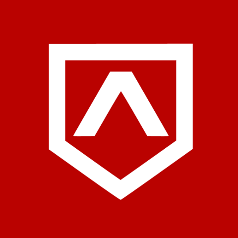

# 2020 So Far

 

2020 has been very busy so far with some big changes.

Since my last entry, I've:
- Finished my Back End build week project
- Got a new job as a Team Lead with Lambda School
- Started Labs

# Build Week

My build week project was an app called Essentialism.  Essentialism allows users
to regain control over their choices about where to spend their time and energy
-- based on their core values.

My team consisted of two UI developers, three front-end developers, and myself -
the back-end developer.

I started off by modeling the database schema - which involved thinking about
what tables to create, the relationships between tables, what columns to include within each table, and restrictions to place on certain columns.

Once the database schema was complete, I set up the backend scaffolding by
initializing with npm, installing dependencies, setting up knex, and creating
folders + files for the data, models, routers, api and authentication.

The next step I took was to create migrations and seeds for the development and
test databases.

I proceeded with a TDD approach.  I wrote tests for the server and models, and
wrote code to get the tests to pass.  Writing the tests before the code took
more time and effort then I expected, and I ran into a bug where the model tests
wouldn't pass if I ran them all at once.  Ultimately, I think it was worth it -
it kept me focused on the essential features and any bugs surfaced immediately.

The biggest hurdle I encountered was migrating from SQLite to PostgreSQL.  I
ended up buying and completing Jose Portilla's 'The Complete SQL Bootcamp'
course to get more comfortable with advanced SQL queries and PostgreSQL.  After
days of tinkering, asking questions in the Lambda help channels, and digging
through Stack Overflow, I managed to get my APIs live and working on Heroku.

You can check out the code and documentation here:
https://github.com/Essentialism-1-bw/Back-end

# Team Lead

I received an offer to be a full-time Team Lead for Lambda School near the end
of December.  Being a TL is an opportunity to mentor other students, strengthen
technical and leadership skills, as well as gain valuable professional
development experience. After working at my
local Amazon delivery station warehouse for almost two years, I was excited to
transition into a role that involved development skills and the opportunity to
assist new students on their web development journey. 

I was impressed by the presentation and depth of the material provided during
the week of TL training.  There's a lot of work behind the scenes that TLs
handle - which I never noticed as a student.  I have a lot more respect for my
past and current TLs.

I've been a TL for two weeks now, and my group consists of seven students.  They
come from a range of diverse backgrounds and are motivated to improve their
skills as developers.

My average day as a TL consists of:
- Staff meeting
- Attendance
- Answer questions in the help channel
- 1:1 module reviews with students
- Stand up meeting with students

One thing I didn't expect was the amount of administrative tasks I would be
responsible for as a TL.  I would like to spend more time with my students going
over the material they learned that week.  But overall, it's been a rewarding
and enjoyable job.

# Labs

The mission of Lambda School Labs is to provide students with **real** product
development experience. 

For the part-time cohorts, Labs lasts four months.

Rough schedule overview:

Weeks 1-4: Work on the Project Vision Document, which covers the Vision
(problem & objectives), Architecture details and User personas

Weeks 5 - 15: At least three Labs cycles - which are essentially Agile
development cycles (design -> build -> test -> repeat).

Week 16: Production deployment

My project is Juxta City Data - an app that analyzes data from cities such as
population, cost of living, crime rates, and many other social and economic
factors that are important in deciding where someone would like to live.  It
provides the data in an inuitive and well designed interface.

My team consists of three data scientists, two UX designers and four full stack
developers (including myself).

My team members are motivated, intelligent individuals and I'm looking forward
to what we'll accomplish over the next few months.  We're only
in the planning phase, but I've already picked up some useful information about data science and UX during our meetings.

---

Overall it's been a busy but productive start to the year thus far.

I'm looking forward to continue to grow both professionally and personally 👊

